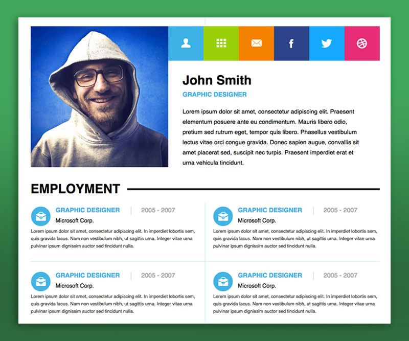

## Sprint 1 - Goals

Your journey to Frontend Web development begins today. Your journey is broken down into sprints with each sprint having a specific goal. You are now in Sprint 1

### Learning
- Basics of HTML and CSS
- Responsive Web pages using Bootstrap library

### Building
- A personal profile page

## Week 1

### Learning Outcomes
* Why do we separate HTML and CSS?
* What are classes and IDs (and how are they different)?
* What are elements?
* What are tags?
* What are attributes?
* What are forms?
* What is a div?
* What are selectors?
* What are properties?
* What are values?
* What is the "query string" in a URL and what does it do?
* What is the difference between "pixels" and "ems"?
* How do CSS styles for a particular element get inherited?  i.e. how does an element get its "default" styles?
* What are two CSS attributes you can change to push an element around on the page?
* What are the three different ways to include CSS in your project or use CSS to style a particular element?
* What is the "default stylesheet" or "user agent stylesheet"?
* Why use a CSS reset file?

### Building
* A static personal profile page to showcase to a recruiter.
The desired end stage of the webpage is as below...

### Why to do this

HTML is the markup that contains all the actual stuff that a web page has. All the text on this page you're reading right now lives inside HTML tags that tell your browser how to order the content on the page.  Go on, right click any element on the page and choose "Inspect Element" to open up your browser's Developer Tools and it will show you the structure of the page.

[CSS](http://skillcrush.com/2012/04/03/css/) tells the browser if you want to display any of those tags a particular way, for instance, turning its background blue and pushing it a little to the left.  In your Developer Tools, you can see the CSS styles in another panel, usually showing which specific properties were inherited from which lines of CSS.

### Topic 1: HTML Basics

### Learning Outcomes
To consider yourself having learnt and applied HTML these are the basic questions you should have the answers to. If you don't have the answers to these questions, then revisit the material.

Must Know
* Why do we separate HTML and CSS?
* What are classes and IDs (and how are they different)?
* What are elements?
* What are tags?

### Learning Tasks

Can embed relevant youtube videos. Prescribe the exact time to watch the video.
<iframe width="560" height="315" src="https://www.youtube.com/embed/UB1O30fR-EE" frameborder="0" allow="accelerometer; autoplay; encrypted-media; gyroscope; picture-in-picture" allowfullscreen></iframe>

  1. Do the [Codecademy HTML course](https://www.codecademy.com/learn/learn-html) (only the free stuff) for a healthy baseline understanding of HTML.  Keep track of the most commonly used elements in HTML. [Estimated Time: 4hrs]

CodePen Assignment

Now that you have gone through the above course, do this small assignment on CodePen. This assignment will take you 10 minutes to complete. If you are unable to do this assignment, then go back to the resource and revise your concepts.

  See the Pen <a href="https://codepen.io/lambdaschool/pen/RyVowM/">
  Lesson 1 - Intro to Web Development</a> by Lambda School (<a href="https://codepen.io/lambdaschool">@lambdaschool</a>)
  on <a href="https://codepen.io">CodePen</a>.

2. Next have a look at all the different elements of HTML that make up your general webpage. The best reference is MDN documentation. Have a look [here](https://developer.mozilla.org/en-US/docs/Web/HTML/Element#Content_sectioning) [Estimated Time: 6hrs]

3. Still have some questions on HTML. Refer to [Shay Howe's HTML tutorial](https://learn.shayhowe.com/html-css/building-your-first-web-page/). [Estimated Time: 10 hrs]   

### Additional Learning
This section contains helpful links to other content. It isn't required, so consider it supplemental for if you need to dive deeper into something.

* [W3 Schools' Elements of HTML](https://www.w3schools.com/html/html_elements.asp)
* [OverAPI's HTML Cheat Sheet](http://overapi.com/html)

More Practise Code Pens

  See the Pen <a href="https://codepen.io/zuraizm/pen/vGDHl/">
  Very Simple Slider</a> by zuraiz (<a href="https://codepen.io/zuraizm">@zuraizm</a>)
  on <a href="https://codepen.io">CodePen</a>.

### Project Tasks

Objective: Build a CodePen.io app that is functionally similar to this: https://codepen.io/freeCodeCamp/full/zNBOYG.

You can use HTML, JavaScript, and CSS to complete this project. Plain CSS is recommended because that is what the lessons have covered so far and you should get some practice with plain CSS. You can use Bootstrap or SASS if you choose. Additional technologies (just for example jQuery, React, Angular, or Vue) are not recommended for this project, and using them is at your own risk. Other projects will give you a chance to work with different technology stacks like React. We will accept and try to fix all issue reports that use the suggested technology stack for this project. Happy coding!

- User Story #1: My portfolio should have a welcome section with an id of welcome-section.
- User Story #2: The welcome section should have an h1element that contains text.
- User Story #3: My portfolio should have a projects section with an id of projects.
- User Story #4: The projects section should contain at least one element with a class of project-tileto hold a project.
- User Story #5: The projects section should contain at least one link to a project.
- User Story #6: My portfolio should have a navbar with an id of navbar.
- User Story #7: The navbar should contain at least one link that I can click on to navigate to different sections of the page.
- User Story #8: My portfolio should have a link with an id of profile-link, which opens my GitHub or FCC profile in a new tab.
- User Story #9: My portfolio should have at least one media query.
- User Story #10: The height of the welcome section should be equal to the height of the viewport.
- User Story #11: The navbar should always be at the top of the viewport.
You can build your project by forking this CodePen pen. Or you can use this CDN link to run the tests in any environment you like: https://cdn.freecodecamp.org/testable-projects-fcc/v1/bundle.js
